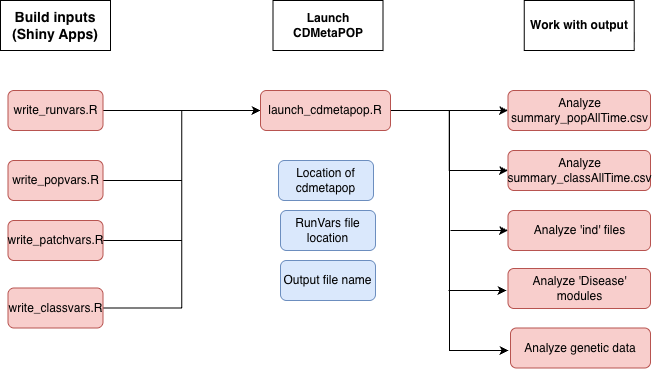

# Summary

This R package is a companion to CDMetaPOP, an individual‑based, spatially explicit population genetics and demography model built on python architecture @landguth2017cdmetapop. The package includes four Shiny applications that allow users to construct the four fundamental input files required by CDMetaPOP. It also provides a function to launch CDMetaPOP directly from R, as well as several functions for analyzing CDMetaPOP output.

# Statement of need

This package is designed to facilitate the use of CDMetaPOP by an audience comprised of researchers, including evolutionary biologists, landscape ecologists, geneticists, and epidemiologists. cdmetapopR provides an R‑based platform for new users interested in applying CDMetaPOP to their own study systems. By offering user‑friendlier tools for first‑time implementation, the package lowers the barrier to entry and is expected to promote broader adoption of CDMetaPOP across multiple research disciplines.

# Software design

The software provides four Shiny applications that can be used to construct the core input files required by CDMetaPOP (e.g. write_runvars.R(); write_popvars.R(); Figure 1). Each Shiny app offers a streamlined approach to input‑file creation by guiding users through a series of choices, referencing help from the CDMetaPOP manual when needed, and modifying standard default input files based on those selections. Once users have completed their inputs within a Shiny app, they can download the resulting file and use it to launch CDMetaPOP.

The launch_cdmetapop() function launches a command prompt (Windows) or terminal (Linux/Mac) that will call Python and supply the five arguments needed to launch CDMetaPOP simulations (Figure 1).

The five arguments are: 1) the location of the Python executable, 2) the location of the CDMetaPOP.py file, 3) the location of the directory where the RunVars.csv file is stored for the run, 4) the name of the RunVars file to run, and 5) the name of the output directory to be stored in the same location as runVars Directory. This function returns an output directory with the CDMetaPOP output files, which can then be analyzed using the package's built‑in functions or other tools.

The built‑in functions for analyzing CDMetaPOP are separated into four major classes and include: 1) a function to read in and summarize population demographics and genetics: xxxx.r extracted from output summary_popAllTime.csv, 2) a function to read and summarize age and size class dynamics xxxxx.r extracted from summary_classAllTime.csv, 3) a function to compute metrics scores across ind files (e.g. movement/ demographic, genetic structure, histograms of age_size structure dynamics, selection). These functions are designed to facilitate the analysis of CDMetaPOP output and provide users with initial insights into their simulations. These functions are designed to handle both in-memory and file-based workflows, accepting either a dataframe or a file path as input. They can also process outputs recursively from multiple directories (e.g. Monte Carlo runs or different species), extracting user-specified outcome variables and generating corresponding visualizations.

The package leverages on several domain-standard R packages for efficient data wrangling and transformation (dplyr and tidyr, reshape2), spatial (terra, graph4lg and gdistance) and population genetic (adegenet, poppr) analysis, visualization (ggplot2). Interactive user interface is provided with the use of shiny and shinyBS. @dplyr, @tidyr, @reshape2, @terra, @graph4lg, @gdistance, @adegenet, @poppr, @ggplot2, @shiny, @shinyBS.

The package integrates with the broader R/CRAN ecosystem, including documentation generated with roxygen2 and testing implemented using testthat. @roxygen2, @testthat.

# Research impact statement

Individual-based models (IBMs) are a powerful tool for understanding complex ecological and evolutionary processes, as they allow researchers to simulate the behavior and interactions of individual organisms within a population. CDMetaPOP is an open source IBM that combines demography and genetics in a spatially explicit framework, making it particularly useful for studying population dynamics, gene flow, and the effects of landscape features on populations. 
CDMetaPOP has a steep learning curve and is still underutilized in the research community. This package is designed to make CDMetaPOP more accessible to a wider audience of researchers, including those who may not have extensive experience with Python or command-line interfaces. By providing user-friendly tools for input file creation and analysis of CDMetaPOP output, the package aims to promote broader adoption of CDMetaPOP across multiple research disciplines.

# License

GNU General Public License v3.0( GPLv3) (<https://www.gnu.org/licenses/gpl-3.0.html>)

# AI usage disclosure

AI tools used included: OpenAI Codex was used to assist with code generation, debugging, and documentation drafting. All AI-generated code and text were reviewed, modified, tested, and validated by the authors. The authors made all substantive design, implementation, and scientific decisions and take full responsibility for the software and manuscript content.

# Acknowledgements

We acknowledge contributions from Marissa Roseman and Baylor Fain for reviewing the package and providing useful feedback. Thanks Allison. 

# References

 Link to the software archive: <https://doi.org/10.5281/zenodo.19687119>
